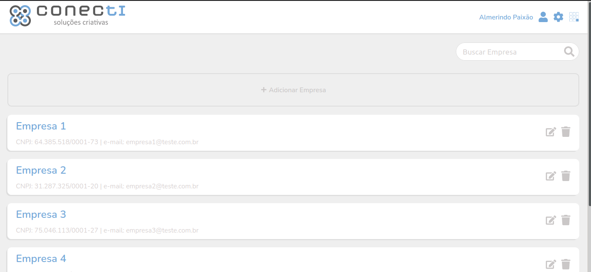
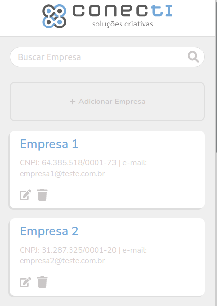
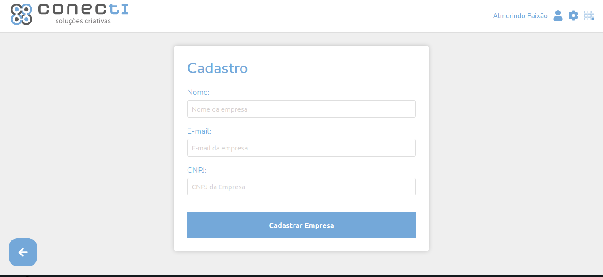
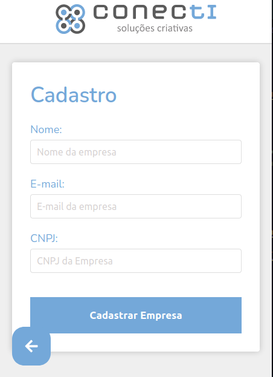
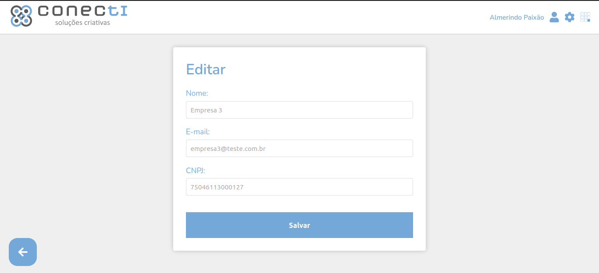

# Avaliação Front-End

 

  

 

  <a href="#computer-desafio">Desafio</a>&nbsp;&nbsp;&nbsp;|&nbsp;&nbsp;&nbsp;
  <a href="#rocket-tecnologias">Tecnologias</a>&nbsp;&nbsp;&nbsp;|&nbsp;&nbsp;&nbsp;
  <a href="#pencil-fontes">Fontes</a>&nbsp;&nbsp;&nbsp;|&nbsp;&nbsp;&nbsp;
  <a href="#heavy_check_mark-resultado">Resultado</a>&nbsp;&nbsp;&nbsp;|&nbsp;&nbsp;&nbsp;
  <a href="#memo-licença">Licença</a>

 &nbsp;&nbsp;
 &nbsp;&nbsp;
 

## :computer: Desafio

Elaborar um fluxo básico de listagem, cadastro, edição, busca e exclusão de empresas (CRUD) com interações de front-end, onde todas as páginas deverão ser responsivas.

Deve ser feita a implementação usando algum dos frameworks SPA ( Vue, React ou Angular )

Para o CSS utilizar algum pré-processador SASS ou LESS

 

## :rocket: Tecnologias

- TypeScript
- React
- JavaScript
- Sass
- Eslint
- Prettier

 

## :pencil: Fontes

- Font awesome
- Nunito

 

## :heavy_check_mark: Resultado

### Landing Page

### Landing Page Mobile

### Register Page

### Register Page Mobile

### Edit Page

 

## :memo: Licença

Esse projeto está sob a licença MIT. Veja o arquivo [LICENSE](https://github.com/almerindopaixao/avaliacao-frontend/blob/main/LICENSE) para mais detalhes.

 
 

&copy; Powered by Almerindo Paixão :heart:

 